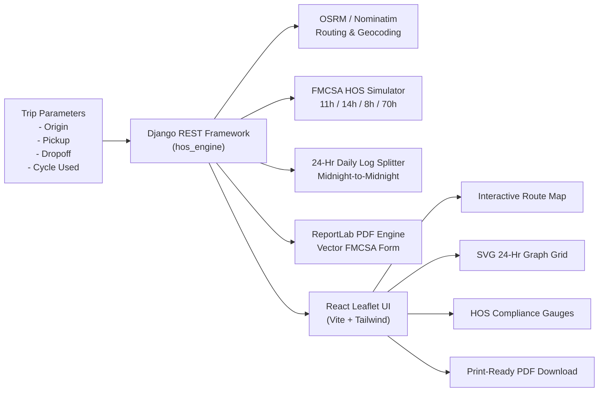

# 🚛 Spotter ELD & FMCSA Hours of Service (HOS) Trip Planner

[](https://www.djangoproject.com/)
[](https://reactjs.org/)
[](https://vitejs.dev/)
[](https://tailwindcss.com/)
[](https://leafletjs.com/)
[](LICENSE)

> A full-stack web application built with **Django REST Framework** and **React (Vite + Tailwind CSS + Leaflet)** for automated commercial truck trip planning, FMCSA 49 CFR Part 395 compliance simulation, interactive route mapping, and 24-hour Driver's Daily Log sheet generation with print-ready PDF export.

---

## 📖 Table of Contents
1. [Project Overview](#-project-overview)
2. [FMCSA 49 CFR Part 395 Compliance Rules](#-fmcsa-49-cfr-part-395-compliance-rules)
3. [Full-Stack Architecture](#-full-stack-architecture)
4. [Subproject Documentation](#-subproject-documentation)
5. [Quick Start Guide](#-quick-start-guide)
6. [REST API Summary](#-rest-api-summary)
7. [Automated Testing](#-automated-testing)
8. [Deployment Guide](#-deployment-guide)

---

## 🌟 Project Overview

The **Spotter HOS & ELD Trip Planner** takes trip details as inputs:
- **Current Location** (Origin / Home Terminal)
- **Pickup Location** (Shipper Loading Stop)
- **Dropoff Location** (Consignee Unloading Stop)
- **Current Cycle Hours Used** (0.0 – 70.0 hrs)

And produces:
1. **Interactive Route Map**: Powered by Leaflet and OpenStreetMap showing the route polyline, stop locations, fueling stops, 30-min breaks, and 10-hr sleeper layovers with interactive popups.
2. **Official 24-Hour Driver's Daily Log Sheets**: Automatically splits multi-day trips into discrete midnight-to-midnight (00:00–24:00) sheets, draws the continuous stepped ELD line across the 4 standard duty lines, computes exact line totals summing to 24.0h, populates timestamped remarks, and calculates the 70hr/8day rolling recap.
3. **Print-Ready PDF Export**: Generates vector PDF logbook files using ReportLab matching official FMCSA paper log sheets.
4. **HOS Compliance Dials**: Real-time gauges for the 11-hour driving clock, 14-hour duty window, 8-hour break countdown, and 70-hour cycle meter.



---

## ⚖️ FMCSA 49 CFR Part 395 Compliance Rules

| Regulation | FMCSA Standard | Spotter Engine Implementation |
| :--- | :--- | :--- |
| **11-Hour Driving Limit** | Max 11 hours driving after 10 consecutive hours off duty | Strict cutoff; driving halts and enters 10-hr rest when 11.0 hrs is reached |
| **14-Hour Duty Window** | Cannot drive past the 14th consecutive hour from shift start | Starts at first on-duty activity (e.g. pre-trip inspection); triggers 10h rest when window expires |
| **30-Minute Rest Break** | Break required before exceeding 8 cumulative driving hours | Automatically scheduled at safe rest area intervals along route |
| **10-Hour Consecutive Rest** | 10 consecutive hours off-duty/sleeper berth to reset 11h/14h clocks | Scheduled as Sleeper Berth (Line 2) layovers resetting shift clocks |
| **70-Hour / 8-Day Cycle** | Cannot drive after 70 on-duty hours in 8 consecutive days | Dynamic rolling cycle counter, end-of-day recap table, and cycle threshold alerts |
| **Fueling Interval** | Fueling required at least once every 1,000 miles | Automatically inserts 30-min fuel stops (On Duty Not Driving) along route polyline |
| **Pickup & Dropoff** | Loading and unloading cargo | 1.0 hour On Duty Not Driving at Shipper pickup and Consignee dropoff |
| **Inspections** | Daily pre-trip and post-trip inspections | 15-min On Duty Not Driving at start and conclusion of daily duty shifts |

---

## 📂 Full-Stack Architecture

```
spotter/
├── README.md                 # Master full-stack project documentation
├── vercel.json               # Vercel deployment configuration
├── .gitignore                # Git ignore rules for Python and Node
├── backend/                  # Django REST Framework Backend
│   ├── README.md             # Dedicated Backend documentation
│   ├── manage.py
│   ├── requirements.txt      # Python dependencies (Django, DRF, ReportLab, etc.)
│   ├── spotter_backend/      # Project settings, WSGI/ASGI, URLs
│   └── hos_engine/           # Core HOS application
│       ├── services/
│       │   ├── router.py             # OpenStreetMap & OSRM integration
│       │   ├── hos_calculator.py     # FMCSA 70hr/8day simulation engine
│       │   ├── log_sheet_generator.py # 24-hr log splitter & recap calculator
│       │   └── pdf_generator.py      # ReportLab vector PDF generator
│       ├── serializers.py    # Request & response serializers
│       ├── views.py          # API endpoints (/plan-trip, /export-pdf, /geocode)
│       ├── urls.py           # URL route definitions
│       └── tests.py          # Unit test suite
└── frontend/                 # React 18 + Vite + Tailwind CSS Frontend
    ├── README.md             # Dedicated Frontend documentation
    ├── package.json
    ├── vite.config.js        # Vite config with API proxy
    ├── tailwind.config.js    # Tailwind styling theme
    ├── index.html            # Web entry point
    └── src/
        ├── main.jsx          # React DOM root
        ├── App.jsx           # Application layout and state
        ├── index.css         # Global styles & Leaflet overrides
        ├── services/api.js   # API client service
        ├── utils/formatters.js # Utility formatters
        └── components/       # UI Components
            ├── Header.jsx            # Brand header & navigation
            ├── TripInputForm.jsx     # Form with autocomplete & presets
            ├── HosClocks.jsx         # 11h, 14h, 8h break, 70h cycle gauges
            ├── RouteMap.jsx          # Leaflet map with custom HOS stop markers
            ├── DailyLogSheet.jsx     # Multi-day logbook viewer & PDF export
            ├── LogGridCanvas.jsx     # High-definition SVG 24-hour log graph
            ├── ItineraryTimeline.jsx # Step-by-step chronological itinerary
            ├── TripSummary.jsx       # Key performance metrics
            ├── HosRulesGuideModal.jsx # FMCSA regulations guide modal
            └── SampleTripsModal.jsx   # Curated test scenarios modal
```

---

## 📚 Subproject Documentation

- 🔗 **[Backend Documentation (`backend/README.md`)](file:///D:/spotter/backend/README.md)**: Details on the HOS simulation algorithms, 24-hour day splitting, ReportLab PDF rendering, DRF endpoints, and testing.
- 🔗 **[Frontend Documentation (`frontend/README.md`)](file:///D:/spotter/frontend/README.md)**: Details on the React component hierarchy, SVG log canvas rendering, Leaflet map configuration, state management, and styling.

---

## 🚀 Quick Start Guide

### Prerequisites
- **Python 3.10+**
- **Node.js 18+** & **npm**

---

### Step 1: Start the Backend Service

```bash
# Navigate to backend
cd backend

# (Optional) Create and activate virtual environment
python -m venv venv
# Windows:
venv\Scripts\activate
# Linux/macOS:
source venv/bin/activate

# Install Python dependencies
pip install -r requirements.txt

# Run migrations
python manage.py migrate

# Start development server
python manage.py runserver 127.0.0.1:8000
```
*Backend API is live at: `http://127.0.0.1:8000/api/`*

---

### Step 2: Start the Frontend Application

```bash
# In a new terminal, navigate to frontend
cd frontend

# Install Node dependencies
npm install

# Start Vite dev server
npm run dev
```
*Frontend application is live at: `http://localhost:5173/`*

---

## 📡 REST API Summary

| Method | Endpoint | Description |
| :--- | :--- | :--- |
| `POST` | `/api/plan-trip/` | Computes route, runs HOS simulation, and generates daily log sheets |
| `POST` | `/api/export-pdf/` | Generates and downloads official FMCSA Daily Logbook PDF |
| `GET` | `/api/geocode/?q=<query>` | Autocomplete search for US addresses and cities |
| `GET` | `/api/sample-trips/` | Retrieves preset test scenarios (Cross-Country, Regional, Short Haul, Near Limit) |
| `GET` | `/api/health/` | Service health status check |

---

## 🧪 Automated Testing

Execute the backend automated test suite:
```bash
cd backend
python manage.py test
```
**Test Coverage Includes:**
- Simulation of complete trip lifecycles (pre-trip, leg 1, loading, leg 2, unloading, post-trip).
- 11-hour driving limit enforcement & 10-hour sleeper berth reset verification.
- 30-minute rest break insertion before 8 cumulative driving hours.
- 1,000-mile fueling stop interval validation.
- Verification that all generated daily log sheets satisfy $\sum \text{Lines } 1..4 = 24.00 \text{ hours}$.
- ReportLab PDF generation binary verification.
- REST API endpoint HTTP contract tests.

---

## 🌐 Deployment Guide

### Deploying Frontend to Vercel
The repository includes a root `vercel.json` configured for automated Vite builds:
```json
{
  "buildCommand": "cd frontend && npm install && npm run build",
  "outputDirectory": "frontend/dist",
  "framework": "vite"
}
```

### Deploying Backend to Cloud (Render / Railway / AWS / DigitalOcean)
The Django backend can be run in production with Gunicorn:
```bash
cd backend
pip install gunicorn
gunicorn spotter_backend.wsgi:application --bind 0.0.0.0:8000
```
Set environment variables:
- `DJANGO_SECRET_KEY`: Secure secret key
- `DEBUG`: `False`
- `ALLOWED_HOSTS`: Your production domain
